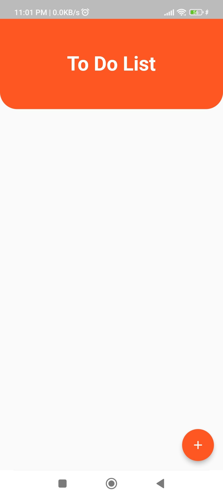
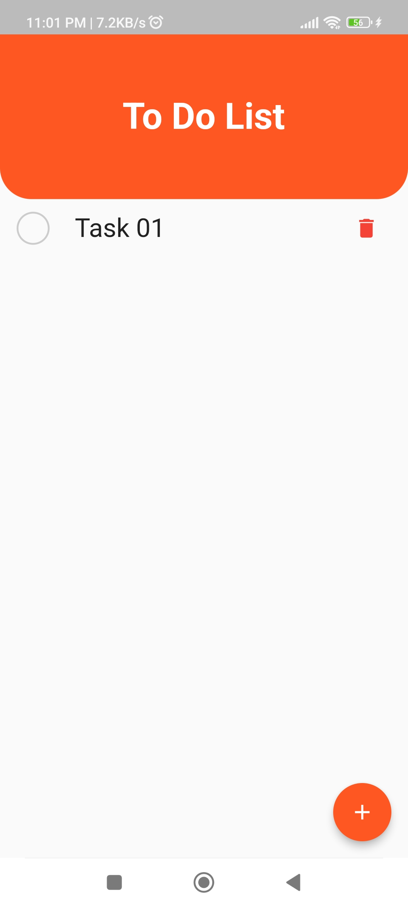
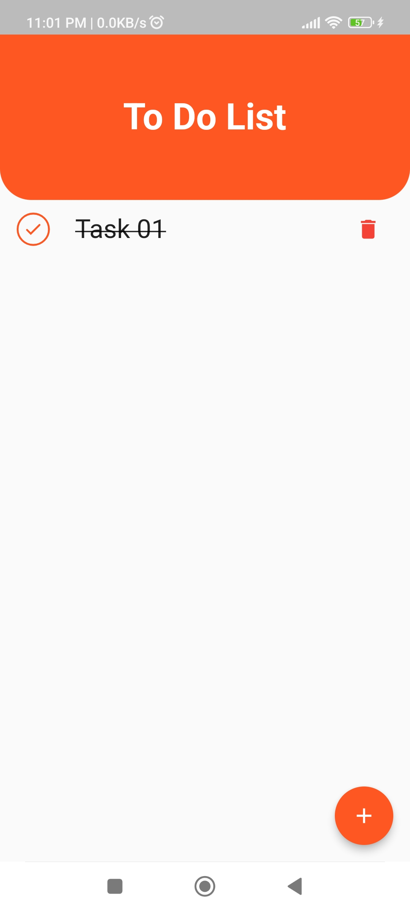

**# Getting Things Done with Provider: A Flutter Todo App **

Welcome to this hands-on project where you'll master Provider state management while building a practical todo app in Flutter!

Inspired by: https://www.youtube.com/watch?v=6r-L3dYfyQI&t=2s

**Key Features:**

* Create, read, update, and delete todo tasks with ease.
* Experience seamless state management with Provider, keeping your app data organized and reactive.
* Explore best practices for structuring Flutter apps with Provider.
* Learn how to manage app state effectively for a smooth user experience.
* msh_checkbox: ^2.0.1 added for checkbox .

**Getting Started:**

1. Clone the repository: `git clone`
2. Install dependencies: `flutter pub get`
3. Run the app: `flutter run`

**Project Structure:**

* **lib/:** Contains the core app code.
    * **main.dart:** The app's entry point.

**Key Concepts Explored:**

* Provider setup and integration
* Creating ChangeNotifier classes for state management
* Using Consumer and Provider.of for accessing and updating state
* Managing CRUD operations with Provider
* Building reactive UI components

**Contributions:**

Feel free to contribute to this project by:

* Reporting issues or suggesting improvements.
* Creating pull requests with new features or bug fixes.
* Sharing your insights and experiences with Provider.

 **Happy Learning and Todo-ing! **

 **Screenshot**

